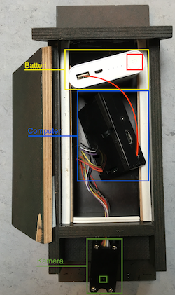
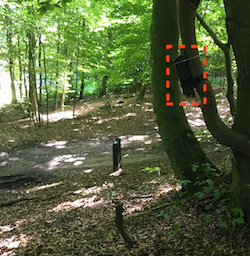

# MTB
A project for recognizing and counting mountain bikers and people walking in the forrest using a small thermal camera.

   
")  

## Getting up and running
NB: A few things are out of data and needs to be updated

To start user interface, type:
```bash
startx
```

The capture program is executed from a script that runs when booting up. To enable/disable automatic capture on boot up:

- $ `sudo nano /etc/profile`

comment/uncomment last line “sudo python /home/pi/startupCapture/capture.py

When transferring files, use filezilla. The large number of files cannot be transferred to usb stick or compressed to e.g. .zip

## Software
"thermal capture" for capturing and storing 16 bit 80x60 images at 7 fps to sd card

"data processing" for detection and evaluation


## Hardware
Computer: Raspberry Pi 2

Thermal camera: Lepton LWIR 80 × 60

Power: 10.400mAh
